SRA Alignment Pipeline
======
## Table of Contents
- [Introduction](#introduction)
- [Installation](#installation)
- [Input Data](#input-data)
- [Output Data](#output-data)
- [Pipeline Overview](#pipeline-overview)
- [Usage](#usage)
  - [Usage Examples](#usage-examples)
  - [Test the Pipeline](#test-the-pipeline)
  - [Post-Run Cleanup and Archiving](#post-run-cleanup-and-archiving)
- [Pipeline Directed Acyclic Graphs](#pipeline-directed-acyclic-graphs)
- [Reproducibility and Docker Images](#reproducibility-and-docker-images)
- [Contributing Guidelines](#contributing-guidelines)
- [License](#license)
  - [Third-Party Software](#third-party-software)
  - [Disclaimer](#disclaimer)

## Introduction
- This nextflow pipeline is designed to simplify the process of aligning sequence data from the Sequence Read Archive (SRA) to a reference genome from NCBI Nucleotide. 
- It automates the process of downloading data, performing quality control, aligning sequences, and calling variants. 
- You can learn more about these databases by following these links: [SRA](https://www.ncbi.nlm.nih.gov/sra/docs/) and [NCBI Nucleotide](https://www.ncbi.nlm.nih.gov/books/NBK49541/). 

## Installation
**Important:** Before you can use this pipeline, you need to install Nextflow and Docker. 
- Nextflow can be installed by following the instructions [here](https://www.nextflow.io/docs/latest/getstarted.html). 
- Docker can be installed by following the instructions [here](https://docs.docker.com/get-docker/). 
- This pipeline now resolves its runtime images from a tracked image manifest and has been modernized for current multi-architecture Docker builds. Local validation in this repository was performed with Nextflow 22.10.7 and Docker 29.x on arm64, and CI currently exercises Nextflow 23.04.0 on Ubuntu.

## Input Data

The pipeline accepts input data in two ways:

1. **Command Line**: You can provide SRA accession numbers and NCBI identifiers directly via command line.
2. **CSV File**: Alternatively, you can provide a CSV file with SRA accession numbers in the first column and NCBI identifiers in the second column.

Please note the following:

- Any SRA accession type can be used (SRR/ERR/DRR, SRX/ERX/DRX, SRP/ERP/DRP, etc.).
- For accessions with multiple SRRs, the given identifier will be associated with all SRRs (up to a maximum of 20).
- If you need to extract more than 20 SRRs from a given SRA accession, please use [SRA-Explorer](https://sra-explorer.info/) or other appropriate tools.
- To find an appropriate NCBI reference genome identifier, visit [NCBI Nucleotide](https://www.ncbi.nlm.nih.gov/nuccore) and perform a search like: "organism_name"[Organism] AND genome[All Fields].

If both command line and CSV inputs are provided, the pipeline defaults to the CSV. The pipeline requires either command line or CSV input to run.

**Important**: You must provide an [NCBI](https://account.ncbi.nlm.nih.gov/signup/?back_url=https%3A%2F%2Fwww.ncbi.nlm.nih.gov%2Fsra) registered email address to run this pipeline. Providing an email address is required when accessing NCBI services that this pipeline depends on.


## Output Data
The pipeline produces several types of output data, including quality control reports, alignment files, and variant calling results. These files are stored in the `results` directory. See the [Test the Pipeline](#test-the-pipeline) for an example of the output files generated by this pipeline.

### Execution Reports
The pipeline automatically generates Nextflow execution reports:
- `results/pipeline_report.html` — Resource usage and task details
- `results/pipeline_timeline.html` — Timeline of task execution
- `results/pipeline_trace.txt` — Tab-separated trace with detailed metrics per task

These are generated on every run. Open the HTML files in a browser to review.

## Pipeline Overview
The pipeline uses several different open-source packages, including:

| Process(es) | Package(s) | Description | Official Link | GitHub Repository <br> or Documentation | Version |
| --- | --- | --- | --- | --- | --- |
| `download_fasta` | **Biopython, Pysam** | These are used in the `download_fasta` process to fetch a reference genome sequence from NCBI, writing it to a FASTA file, and then compressing the file using pysam's `tabix_compress` function. | [Biopython](https://biopython.org/), [Pysam](https://pysam.readthedocs.io/en/latest/) | [Biopython](https://github.com/biopython/biopython), [Pysam](https://github.com/pysam-developers/pysam) | biopython:1.86, pysam:0.23.3 |
| `download_fastq` | **aria2** | The `download_fastq` process uses aria2 to download fastq.gz files associated with a given SRR via ftp from ENA. aria2 splits each fastq.gz file into three parts to improve download speeds. | [aria2](https://github.com/aria2/aria2) | [aria2](https://aria2.github.io/) | aria2:1.37.0 |
| `run_fasterq_dump` | **prefetch, fasterq-dump** | The `run_fasterq_dump` process uses `prefetch` to download the .sra file associated with the SRR accession and then `fasterq-dump` extracts reads from the .sra file in FastQ format, splitting the reads into forward and reverse reads while skipping technical reads. **Note:** this package only runs if the fastq_download fails. | [SRA Toolkit](https://www.ncbi.nlm.nih.gov/sra/docs/) | [SRA Toolkit](https://github.com/ncbi/sra-tools) | sra-tools:3.2.1 |
| `run_pigz` | **pigz** | The `run_pigz` process uses pigz (parallel gzip) to compress the fastq files from fasterq-dump. **Note:** this package only runs if the fastq_download fails. | [pigz](https://zlib.net/pigz/) | [Pigz](https://github.com/madler/pigz) | pigz:2.8 |
| `run_fastp` | **fastp** | The `run_fastp` process uses fastp to perform quality control and preprocessing of FastQ files. It trims the raw reads and generates cleaned up forward and reverse reads. The `run_fastp` process also outputs a report showing sequence quality and other statistics before and after trimming. | [Fastp](https://opengene.org/) | [Fastp](https://github.com/OpenGene/fastp) | fastp:1.3.0 |
| `run_bowtie2` | **Bowtie2** | The `run_bowtie2` process uses bowtie2 to align the cleaned-up sequence reads to the reference genome downloaded earlier. `run_bowtie2` also generates alignment statistics and files for both mapped and unmapped reads. | [Bowtie2](https://bowtie-bio.sourceforge.net/bowtie2/manual.shtml) | [Bowtie2](https://github.com/BenLangmead/bowtie2) | bowtie2:2.5.5 |
| `run_samtools` | **Samtools** | The `run_samtools` uses samtools to convert the alignment file from `run_bowtie2` from SAM to BAM and then sorts the BAM file. Additionally, samtools indexes the BAM file and the reference genome. | [Samtools](http://www.htslib.org/doc/samtools.html) | [Samtools](https://github.com/samtools/samtools) | samtools:1.23.1 |
| `run_bcftools`, `run_bcftools_filter` | **Bcftools** | Bcftools is used in two distinct ways in this pipeline. Initially, in the `run_bcftools` process, Bcftools is employed for calling variants, generating consensus sequences, and producing statistical data and plots associated with the variant calling. Subsequently, in the `run_bcftools_filter` process, Bcftools filters variants based on inclusion or exclusion criteria provided by the user, generating filtered VCF files, statistics, and plots. If neither --include or --exclude options are provided by the user, then the filtering step will be skipped. | [Bcftools](http://www.htslib.org/doc/bcftools.html) | [Bcftools](https://github.com/samtools/bcftools) | bcftools:1.23.1 |
| `run_qualimap` | **Qualimap** | The `run_qualimap` process uses qualimap to produce a quality control report for the sorted BAM file produced by samtools. | [Qualimap](http://qualimap.conesalab.org/) | [Qualimap](http://qualimap.conesalab.org/doc_html/index.html) | qualimap:2.3 |

## Usage
```
nextflow run https://github.com/sophieships/sra_alignment_pipeline -r main [OPTIONS] OR nextflow run main.nf [OPTIONS]

OPTIONS:
--cpus <int> The number of CPUs you want to use for processing, default: 2. Only the cpus available to your docker daemon can be used.

--email <ncbi-email-address> Your email address registered with NCBI, required.

--image_manifest <path> Path to the tracked container image manifest. Default: conf/images.json.

--container_registry <registry> Override the default registry defined in the tracked image manifest.

--container_namespace <namespace> Override the default namespace defined in the tracked image manifest.

--sra_accession <sra_accession> The accession number of the SRA run you want to process, required if no input_file given.

--identifier <id#> The identifier of the reference genome you want to align to, required if no input_file given.

--input_file <path> Path to input file. Takes a CSV file with two columns: column 1: sra_accession, column 2: identifier, required if no --sra_accession given.

--include <expressions> or --exclude <expressions> A filter to apply to the variant calling process. This should be a string with the filtering criteria in single quotes, like 'DP>200'. More information about this function can be found at the [bcftools filter manual](http://www.htslib.org/doc/bcftools.html#filter) and the allowed [bcftools expressions](http://www.htslib.org/doc/bcftools.html#expressions) for this filter. If you do not want to filter the variants, you can leave this parameter blank.

--ploidy <int> The ploidy of the organism you are analyzing, default: 1.

--L <int> Parameter for bowtie2, from the bowtie2 documentation: "Sets the length of the seed substrings to align during multiseed alignment. Smaller values make alignment slower but more sensitive." The default value is 22. The seed length must be smaller than the read length." Default: 22. For more info, check out the official bowtie2 link above.

--X <int> Parameter for bowtie2, from the bowtie2 documentation:"The maximum fragment length for valid paired-end alignments. E.g. if -X 100 is specified and a paired-end alignment consists of two 20-bp alignments in the proper orientation with a 60-bp gap between them, that alignment is considered valid (as long as -I is also satisfied). A 61-bp gap would not be valid in that case. If trimming options -3 or -5 are also used, the -X constraint is applied with respect to the untrimmed mates, not the trimmed mates." Default: 600 For more info, check out the official bowtie2 link above.
```

> **Tip:** The `-resume` flag tells Nextflow to reuse cached results from previous runs, skipping completed tasks. This is especially useful when a run fails partway through — re-running with `-resume` picks up where it left off.

## Usage Examples
### **Option #1: Run from Github**
To run with sra_accession and identifier provided on the cli, execute the following command in your terminal
```bash
nextflow run https://github.com/sophieships/sra_alignment_pipeline -r main --sra_accession <sra_accession> --identifier <ncbi-id> --cpus <int> --email <ncbi-email-address> -resume```
To run with an input file, execute the following command in your terminal
```bash
nextflow run https://github.com/sophieships/sra_alignment_pipeline -r main --input_file <path/to/input/file.csv> --cpus <int> --email <ncbi-email-address> -resume```

### **Option #2: Clone repo from Github to your local environment**
You can clone the repo using either by HTTPS:
```bash
git clone https://github.com/sophieships/sra_alignment_pipeline.git
``` 
or, if using GitHub CLI:
```bash
gh repo clone sophieships/sra_alignment_pipeline  
```
To run with sra_accession and identifier provided on the cli, execute the following command in your terminal at the root of the cloned repo:

```bash
nextflow run main.nf --sra_accession <sra_accession> --identifier <ncbi-id> --cpus <int> --email <ncbi-email-address> -resume
```
To run with an input file, execute the following command in your terminal at the root of the cloned repo:
```bash
nextflow run main.nf --input_file <path/to/input/file.csv> --cpus <int> --email <ncbi-email-address> -resume```

## Test the Pipeline
Two input files are provided in the `test_data` directory. To run the pipeline on the test data, execute the following command in your terminal at the root of the cloned repo:
```bash
nextflow run main.nf --input_file test_data/test1/test1.csv --cpus <int> --email <ncbi-email-address> -resume```

For this file, process execution should look like:


and the results directory should contain the following files:


**Note:** In case the pipeline fails because memory is exhausted during the bowtie2 process, consider the following steps:

1. **Increase Docker's memory allocation**: Navigate to `Docker Desktop > Settings > Resources > Advanced` and increase the memory limit. 
2. **Increase Docker's swap memory**: If the first step doesn't resolve the issue, increase Docker's swap memory in the same Advanced Settings. Be aware this may result in a slower pipeline execution.

It's important to note that memory usage is proportional to genome size; for instance, to run the pipeline with the human genome, you'll want to use **at least** 16 GB of RAM, but ideally 32 GB or more.


## Post-Run Cleanup and Archiving

After each run of the pipeline, your working directory may become cluttered with output files. To help manage these files, we provide a cleanup and archiving script: archive_nf.sh. This script:

- Keeps your workspace organized.
- Makes it easier to find and review the output of specific runs.

You can find the script at scripts/archive_nf.sh. To run the script after a Nextflow run, use the following command:

```bash
scripts/archive_nf.sh
```

Or you can run the pipeline and the script in one command:
```bash
nextflow run main.nf --input_file test_data/test1/test1.csv --cpus <int> --email <ncbi-email-address> -resume && scripts/archive_nf.sh
```
This command will:

- Create a new subdirectory in the nextflow_archive directory.
- Name the subdirectory run_YYYYMMDD_HHMMSS, where YYYYMMDD is the current date and HHMMSS is the current time.
- Move the work directory, .nextflow directory, .nextflow.log file, and any dangling .nextflow.log* files to this new subdirectory.

Before running the script, make sure it has execution permissions. You can give it execution permissions with the following command:
```bash
chmod +x scripts/archive_nf.sh
```
Remember to run the script from the same directory where you ran the Nextflow pipeline.

## Pipeline Directed Acyclic Graphs
- DAGs were generated using the `-with-dag` option with both `nextflow run` command, e.g.:
```bash
nextflow run main.nf --input_file <path/to/input/file.csv> --cpus <int> --email <ncbi-email-address> -resume -with-dag dag_name.mmd
```
- The contents of the .mmd file were then loaded into [Mermaidv10.2.2 Live Editor](https://mermaid.live/edit#pako:eNpVjk2Lg0AMhv9KyGkL9Q94WGh1t5fCFurN6SFo7AztfDBGpKj_fcd62c0pvM_zhkzY-JYxx-7px0ZTFKhK5SDNoS50NL1Y6m-QZZ_ziQWsd_ya4fhx8tBrH4Jx993mH1cJium8agyijXssGyre_R_HM5T1mYL4cPtLqtHP8FWbi07n_xMdObW-647yjrKGIhQU3wru0XK0ZNr0_rQmCkWzZYV5WlvuaHiKQuWWpNIg_vpyDeYSB97jEFoSLg3dI9ktXH4B_cJWqw) to create the DAGs below.


**Input_File Graph**
***


**CLI_Input Graph**
***



## Reproducibility and Docker Images

To ensure that the results of this pipeline can be reliably reproduced, we run all processes for this pipeline in Docker containers with versioned software. The image names, tags, Dockerfiles, and default registry/namespace are tracked centrally in `conf/images.json`. By default the pipeline resolves runtime images from `docker.io/eoksen`, but you can override that at runtime with `--container_registry` and `--container_namespace`.

If you want to build those images yourself, use the Dockerfiles and helper scripts in the `dockerfiles` and `scripts` directories. The `scripts/build_images.sh` script is for build-time workflows and uses the same manifest as build metadata. It will:

- Build a selected subset of tracked image targets or all of them.
- Default to a local single-architecture build so it does not accidentally push to a personal registry.
- Support explicit multi-architecture publish builds, local or registry-backed BuildKit cache, changed-context builds, and benchmark CSV output.

You can run the `build_images.sh` script with the following commands:
```bash
scripts/build_images.sh
scripts/build_images.sh --targets qualimap,bowtie2 --jobs 1
scripts/build_images.sh --push --namespace <dockerhub-user> --cache-mode registry --benchmark-file benchmarks/build_times.csv
```
Before running the script, make sure it has execution permissions. You can give it execution permissions with the following command:
```bash
chmod +x scripts/build_images.sh
```
To see the tracked build targets, run:
```bash
scripts/build_images.sh --list-targets
```

The `conf/images.json` manifest is the source of truth for container resolution. Its schema is:

- `defaults.registry` and `defaults.namespace`: default registry/namespace used by the pipeline and build script.
- `defaults.publish_platforms` and `defaults.host_platform_map`: default platforms for publish builds and host-local builds.
- `images.<key>.runtime_name` and `images.<key>.version`: the runtime image reference parts used by Nextflow.
- `images.<key>.build.enabled`: whether the image appears in `scripts/build_images.sh --list-targets` and can be selected for builds.
- `images.<key>.build.dockerfile`, `images.<key>.build.context`, and `images.<key>.build.args`: the Docker build inputs used by `scripts/build_images.sh`.

The current required runtime image keys are `aria2`, `bcftools`, `biopython`, `bowtie2`, `fastp`, `pigz`, `qualimap`, `samtools`, `sra_parser`, and `sra_tools`.

To inspect the currently tracked runtime/build targets without duplicating the manifest contents in documentation, use:
```bash
python3 scripts/image_manifest.py list-targets --config conf/images.json
python3 scripts/image_manifest.py build-targets --config conf/images.json --targets fastp
```

When you build with `--cache-mode registry`, BuildKit cache layers should be treated as implementation detail rather than runtime dependencies. By default they now publish as tags under the single cache repository `docker.io/<namespace>/sra-alignment-cache`, which keeps the public runtime namespace easier to scan while preserving remote cache reuse.

The `--changed-since <ref>` option compares the current worktree against the supplied git ref and includes a target when its Dockerfile or Docker build context has changed. If the manifest file itself changed, the helper includes all selected targets. The comparison also considers current uncommitted tracked changes and untracked files, so the result reflects the live worktree rather than only committed differences.

## Contributing Guidelines

We welcome and appreciate contributions from the community! Here's how you can contribute:

### **Reporting Issues**

If you find a bug or have a suggestion for a new feature, please [open a new issue](https://github.com/sophieships/sra_alignment_pipeline/issues). When reporting a bug, please include as much information as possible, including:

- The version of Nextflow you're using
- The operating system you're running on
- The exact command you ran
- Any error messages you received

### **Contributing Code**

We welcome contributions of code, whether it's fixing a bug or implementing a new feature. Here's how you can contribute code:

1. Fork the repository and create a new branch for your changes.
2. Make your changes in your branch. If you're adding a new feature, please include notes about what inputs you have tested so we can replicate that behavior and conduct other tests before pulling.
3. Once you're done with your changes, [open a pull request](https://github.com/sophieships/sra_alignment_pipeline/pulls). Please include a clear description of the changes you made and the rationale behind them.

### **Questions**

If you have any questions about contributing to this project, please feel free to [open a new issue](https://github.com/sophieships/sra_alignment_pipeline/issues) or contact the project maintainers.

Thank you for your interest in contributing to our project!


## License

This project is licensed under the terms of the GNU General Public License v3.0. For the full text of the license, see the [LICENSE.txt](./LICENSE.txt) file.

### **Third-Party Software**

This project includes and depends on various third-party software components. Each of these components is licensed under its own terms, which can be found in the corresponding Dockerfile in the `dockerfiles/multiarch/<image_name>` directory for each Docker image used in this project.

By using this project, you acknowledge that you understand and will comply with all relevant licenses for these third-party components.

### **Disclaimer**

THE SOFTWARE IS PROVIDED "AS IS", WITHOUT WARRANTY OF ANY KIND, EXPRESS OR IMPLIED, INCLUDING BUT NOT LIMITED TO THE WARRANTIES OF MERCHANTABILITY, FITNESS FOR A PARTICULAR PURPOSE AND NONINFRINGEMENT. IN NO EVENT SHALL THE AUTHORS OR COPYRIGHT HOLDERS BE LIABLE FOR ANY CLAIM, DAMAGES OR OTHER LIABILITY, WHETHER IN AN ACTION OF CONTRACT, TORT OR OTHERWISE, ARISING FROM, OUT OF OR IN CONNECTION WITH THE SOFTWARE OR THE USE OR OTHER DEALINGS IN THE SOFTWARE.
